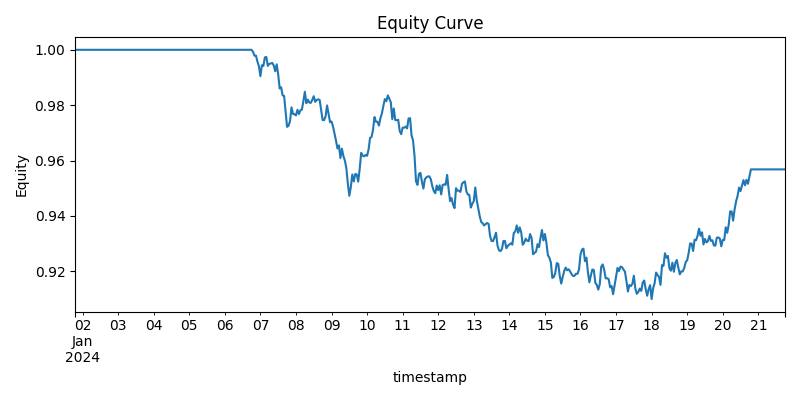
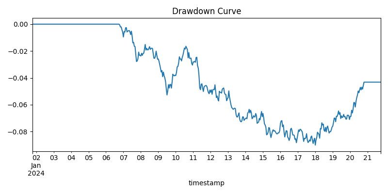
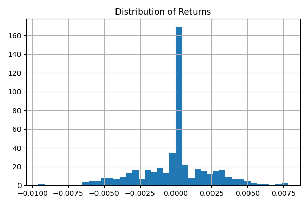

# 📊 Resultados Recientes

Este informe se genera automáticamente a partir de la última ejecución del pipeline (`quantml.pipelines.research`).

---

# QuantML Intraday Report

**Symbol:** SYNTH  
**Timeframe:** 1h  

| Metric | Value |
|---------|--------|
| Sharpe | -0.60 |
| Sortino | -0.78 |
| Max Drawdown | -9.00% |
| CAGR | -2.29% |

---

### Gráficos
- 
- 
- 
- 

